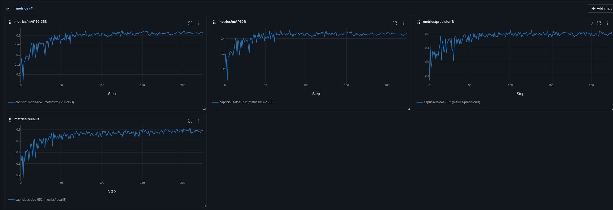
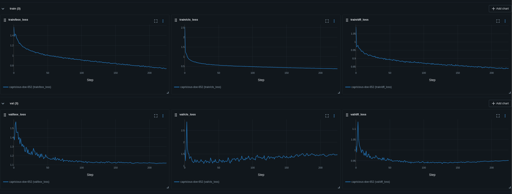

# Report Training

mAP50 là 0.42, mAP50-90 là 0.31, kết quả này không thực sự được tốt

Val box loss đã bão hòa, trong khi đó box loss vẫn giảm, điều này cho thấy model đang bị overfiting 

kiểm tra kết quả Test:
để kết quả thực sự tốt có lẽ sẽ cần nhiều dữ liệu hơn nữa

